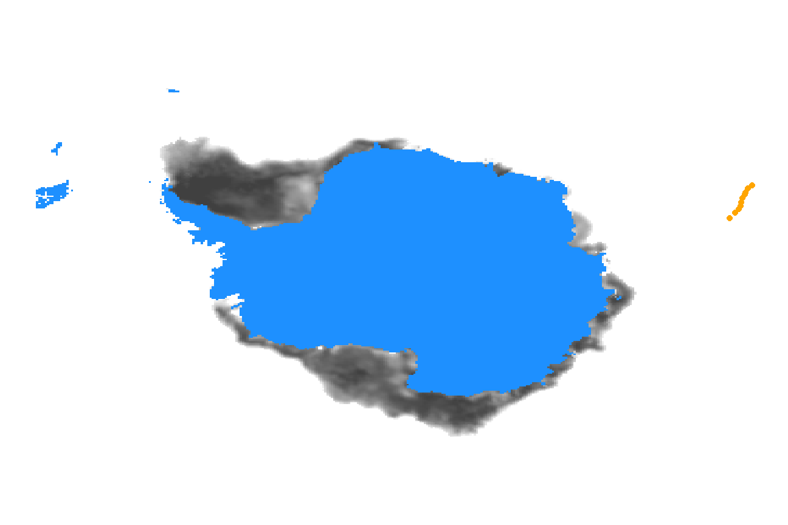

# Adventures with animating rastery things in R

**Ben Raymond, November 2018**

Our demo data:

```R
library(dplyr)
library(raadtools)
library(SOmap)
library(gganimate) ## remotes::install_github("thomasp85/gganimate")
requireNamespace("transformr") ## remotes::install_github("thomasp85/transformr")
requireNamespace("rgdal")
requireNamespace("rgeos")

## track data
ele <- SOmap_data$mirounga_leonina %>% dplyr::filter(id == "ct96-05-13")
## shorten for demo purposes
ele <- ele[1:10, ]

## use a rotated polar projection
polar_proj <- "+proj=stere +lat_0=-90 +lat_ts=-71 +lon_0=0 +k=1 +x_0=0 +y_0=0 +datum=WGS84 +units=m +no_defs +ellps=WGS84 +towgs84=0,0,0"
ele[c("x", "y")] <- rgdal::project(as.matrix(ele[c("lon", "lat")]), polar_proj)

## get sea ice data, one raster per day
dates <- sort(unique(as.Date(ele$date)))
ice_raster <- readice(dates)
icexy <- as_tibble(coordinates(ice_raster))
ice_palette <- scale_fill_gradient(low = "#FFFFFF", high = "#404040", guide = FALSE, na.value = "dodgerblue")
```

A static overview plot:

```R
ggplot() + geom_raster(data = icexy %>% mutate(ice = values(ice_raster[[1]])), aes(x, y, fill = ice)) +
    ice_palette + geom_point(data = ele, aes(x, y), colour = "orange", size = 2) +
    theme_void()
```



## Using gganimate

To use `gganimate`, we need to have time-indexed sea ice data. The sea ice are in raster format, which can't be handled directly by `ggplot`. The brute-force option is to build a data.frame of sea ice data, one row per pixel per date:

```R
## expand out into enormous tibble
icex <- bind_rows(lapply(seq_len(nlayers(ice_raster)), function(z) icexy %>% mutate(ice = values(ice_raster[[z]]), date = dates[z])))

ggplot() +
    geom_raster(data = icex %>% mutate(date = as.numeric(date)), aes(x, y, fill = ice)) +
    ice_palette +
    geom_point(data = ele %>% mutate(date = as.numeric(as.Date(date))), aes(x, y), colour = "orange", size = 2) +
    theme_void() + transition_manual(date)
```


But this uses a lot of memory even with our 10-day demo data, and does not scale well to larger data sets.

## Somewhat more manually

Back when I was a lad, we did this sort of thing by drawing individual frames and stitching them into an animation afterwards. Start with a function that composes an individual frame for a given date:

```R
compose_frame <- function(this_date, lims = NULL) {
    ice_idx <- which(as.Date(getZ(ice_raster)) == this_date)
    this_ice <- icexy %>% mutate(ice = values(subset(ice_raster, ice_idx)))
    this_ele <- ele %>% dplyr::filter(as.Date(date) == this_date)
    p <- ggplot() +
         geom_raster(data = this_ice, aes(x, y, fill = ice)) + ice_palette +
         geom_point(data = this_ele, aes(x, y), colour = "orange", size = 2) +
         theme_void()
    ## if x- and y- limits have been specified, apply them
    ##  this allows us to keep the plot axis limits consistent over frames
    if (!is.null(lims)) p <- p + xlim(lims[1:2]) + ylim(lims[3:4])
    p
}
```

And then build the animation. We can do this using `magick`, which frees us from the need to save individual frames to temporary files or do the stitching manually:

```R
library(magick)
img <- image_graph(640, 480, res = 72)
my_lims <- NULL
out <- lapply(dates, function(dt) {
    p <- compose_frame(dt, lims = my_lims)
    if (is.null(my_lims)) {
        ## save the x- and y-limits for subsequent frames
        my_lims <<- c(layer_scales(p)$x$range$range, layer_scales(p)$y$range$range)
    }
    print(p)
})
dev.off()
animation <- image_animate(img, fps = 5)
## save to file with 
## image_write(animation, "myfile.gif")
print(animation)
```


Unfortunately, though, this still doesn't scale particularly well. Running this on the full track (188 frames) was tenable to generate the `animation` object, but took a long time (30 mins) to save as a gif. I am fairly sure that this is because `magick` uses the `imagemagick` library to do that conversion, whereas `gganimate` uses `gifski`, which is substantially faster. So instead we can save the `ggplot` objects to a list, as before, and generate the gif ourselves using `gifski` (code not run here):

```R
## generate a list of ggplot objects
my_lims <- NULL
out <- lapply(dates, function(dt) {
    p <- compose_frame(dt, lims = my_lims)
    if (is.null(my_lims)) {
        ## save the x- and y-limits for subsequent frames
        my_lims <<- c(layer_scales(p)$x$range$range, layer_scales(p)$y$range$range)
    }
    p
})

png("frame%03d.png")
for (i in seq_len(length(out))) print(out[[i]])
dev.off()
png_files <- sprintf("frame%03d.png", seq_len(length(out)))
gif_file <- gifski(png_files, delay = 0.1)
unlink(png_files)
utils::browseURL(gif_file)
```

Which is much faster.

Not sure if this should be viewed as a stopgap measure until `gganimate` and `ggplot` have better raster support, or as a genuine approach in its own right. It has the distinct aroma of being a rather retrograde step (but, based on my experience so far, it is easier to get control over the details of the animation with this approach, even though it is rather laborious.) Perhaps some helper functions could ease that labour burden (though maybe this sort of process is already well handled by existing packages?). Other encoders could also be used to build the animation (rather than as a gif) - e.g. ffmpeg to create an actual video file, perhaps using `animation::saveVideo`.

